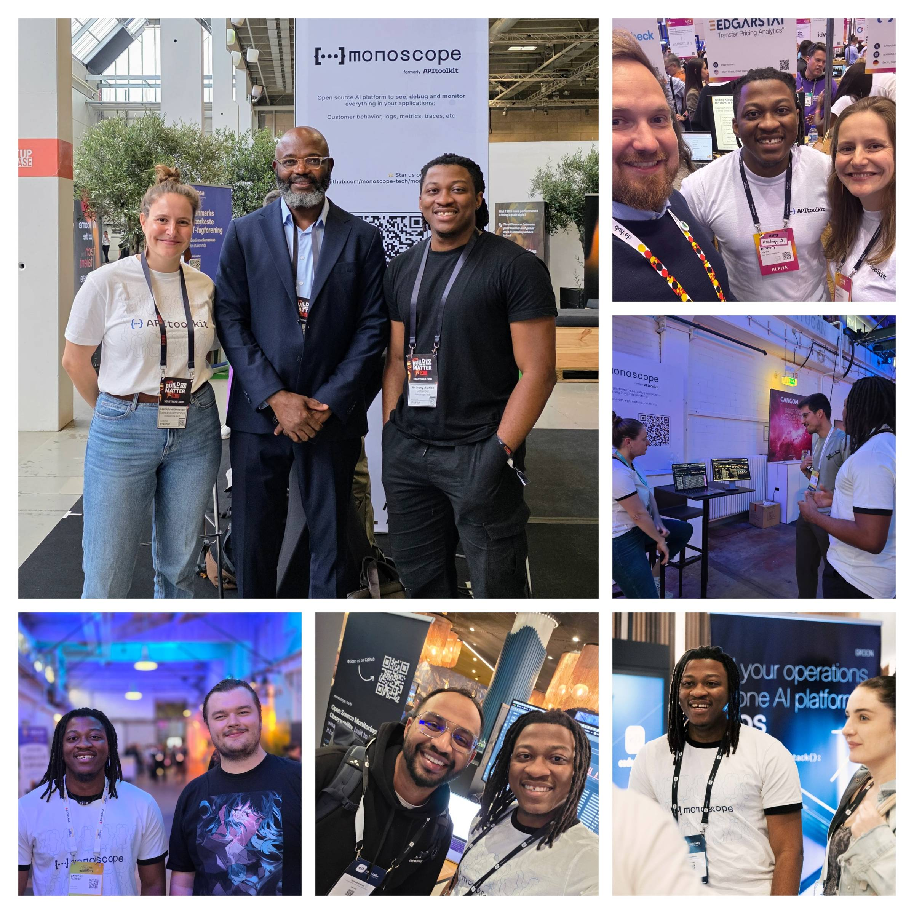
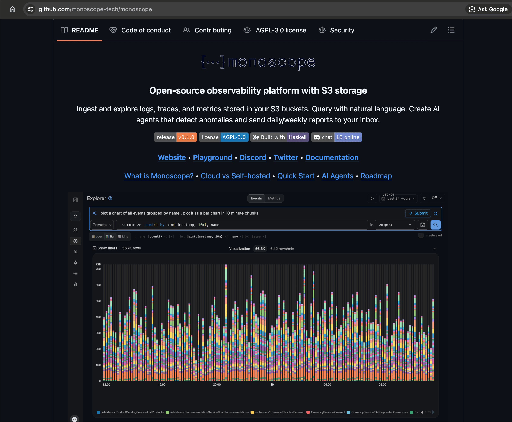

# Monoscope 2025: A Year in Review

As the year ends, I've been reflecting on our journey. Monoscope started three years ago out of frustration: a trivial API bug cost my employer a ton of money, and Datadog missed it completely. I kept thinking: *why can't observability tools catch these obvious anomalies?*

That frustration became Monoscope.

Since then, we've become a critical tool for many tech companies, tired of missing obvious issues. In the spirit of reflection, here are some things that happened in 2025:

## 1. We Rebranded: APItoolkit → Monoscope

After years of monitoring incoming and outgoing API requests and payloads, we listened to you. You wanted the complete observability story: logs, metrics, traces, API observability, and error tracking, all in one place. The new name reflects that expanded mission.

## 2. We Had a Very Active Year

We spoke at conferences and had booths at a bunch of others, from New York to Germany, Nigeria, even Nairobi. Speaking with and nerding out with many of you engineers. It was an intense year.

## 3. We Went Open Source

This was a big decision, and it felt like the right one. You can now run Monoscope locally or on your own infrastructure. Clone the repo, run `docker compose up`, and you're live. PRs and feature requests welcome. And please [star us on GitHub](https://github.com/apitoolkit). It costs you nothing but more stars help other developers perceive us better.

## 4. We Unified Logs, Traces, and API Observability

Years of debugging systems tend to build opinions. Ours: logs and traces shouldn't live in separate silos. A trace is really just a log with a start time, an end time, and maybe a hierarchy.

Our new Event Explorer shows everything in one view. When something breaks, you can spot the cause at a glance, whether it's a slow database query, a failing API call, or an error log. All within context, so you know exactly which customer request triggered it. Powered by OpenTelemetry.

## 5. We Added AI-Powered Queries

Ask questions in plain English. Get the right data, charts, or widgets back. No query language to learn. You can even generate entire monitoring dashboards just by describing what you need.

## 6. We Launched Custom Dashboards

You can now build dashboards to surface specific metrics from your logs, traces, and metrics using natural language or drag-and-drop. Under the hood, each dashboard is just YAML, so you can 2-way sync with a GitHub repo for full GitOps control.

---

The year is ending, but our vision and motivation for the future is stronger than ever.

See you in 2026.

PS: You can reply to this email with any questions or feature requests for 2026.

*— Anthony Alaribe (Cofounder, Monoscope)*
